# HEADHUNTER EMBEDDING REMEDIATION PLAN
## Complete Analysis & Action Plan for Production Readiness

**Generated:** 2025-10-27
**Status:** Ready for execution
**Analyst:** Claude Code Analysis

---

## 🎯 EXECUTIVE SUMMARY

### Current State
- ✅ **Production search working** (961ms p95 latency, 19.9% under 1.2s target)
- ⚠️ **Only 61.7% properly enriched** (17,969/29,142 candidates)
- ⚠️ **28,527 embeddings in production** but only 17,969 from enriched profiles
- ❌ **11,173 candidates missing enrichment** entirely
- ⚠️ **423 candidates quarantined** (failed enrichment)

### Critical Finding
**Production has 10,558 MORE embeddings than enriched profiles in Firestore.**

This confirms your suspicion: Those embeddings were generated from **RAW RESUME TEXT**, not enriched structured data. They need to be regenerated.

### Recommendation
Execute 3-phase remediation to achieve 100% enriched + properly embedded dataset.

**Timeline:** 6-11 hours depending on approach
**Cost:** ~$26 in API calls
**Risk:** Low (incremental with checkpoints)

---

## 📊 DETAILED ANALYSIS

### Data Inventory

| Category | Count | Status |
|----------|-------|--------|
| Total source candidates | 29,142 | Source of truth |
| Enriched in Firestore | 17,969 | ✅ Properly structured |
| Production embeddings | 28,527 | ⚠️ Mixed source (old + new) |
| Missing enrichment | 11,173 | ❌ Needs processing |
| Quarantined/failed | 423 | ⚠️ Needs repair |
| **Embedding discrepancy** | **10,558** | 🔴 OLD embeddings from raw text |

### How Embeddings Are Generated

**Code Evidence** (`services/hh-enrich-svc/src/embedding-client.ts:270-387`):

The `buildSearchableProfile()` method creates embedding text by:

1. **First Priority:** Enriched structured fields
   ```typescript
   // Technical skills from enrichment
   technical_assessment.primary_skills
   skill_assessment.technical_skills.core_competencies

   // Experience from enrichment
   experience_analysis.current_role
   career_trajectory.current_level
   career_trajectory.years_experience

   // Other enriched fields
   leadership_scope, domain_expertise, recruiter_recommendations,
   executive_summary.one_line_pitch, search_keywords
   ```

2. **Fallback Only:** Raw resume text (line 377-384)
   ```typescript
   if (parts.length === 0) {
     const resumeText = getString('resume_text');
     if (resumeText) {
       logger.warn('No enriched data found, falling back to resume_text');
       return resumeText;
     }
   }
   ```

3. **Firestore Verification:** Enriched candidates have **NO** `resume_text` field
   - Only structured enrichment data
   - Confirms embeddings from enriched data use structured fields

### Conclusion
- ✅ **17,969 embeddings** generated from enriched structured data (CORRECT)
- ❌ **~10,558 embeddings** generated from old/raw resume data (INCORRECT - need regeneration)

---

## 🚀 REMEDIATION PLAN (3 Phases)

### Phase 1: Enrich Missing 11,173 Candidates
**Priority:** 🔴 CRITICAL
**Timeline:** 4-6 hours
**Impact:** Brings enrichment coverage to 100%

**Script:** `scripts/enrich_missing_candidates.py`

**What it does:**
1. Reads 11,173 candidates from `data/enriched/missing_candidates.json`
2. Calls `hh-enrich-svc` production service (Together AI enrichment)
3. Service automatically generates embeddings from enriched profiles
4. Updates both Firestore (profiles) + Cloud SQL (embeddings)

**Commands:**
```bash
# Test with small batch first
python3 scripts/enrich_missing_candidates.py --limit 50

# Monitor logs
# Check Firestore count increases

# If successful, run full batch (4-6 hours)
python3 scripts/enrich_missing_candidates.py
```

**Progress Tracking:**
- Script saves progress to `data/enriched/enrich_missing_progress.json`
- Can resume if interrupted
- Failed candidates logged to `data/enriched/enrich_missing_failed.json`

**Expected Result:**
- Firestore: 17,969 → 29,142 enriched candidates
- Cloud SQL: 28,527 → ~39,711 embeddings (adds 11,173 new)
- All new embeddings from enriched structured data

---

### Phase 2: Re-embed 17,969 Existing Enriched Candidates
**Priority:** 🟡 HIGH
**Timeline:** 2-3 hours
**Impact:** Replaces old embeddings with ones from enriched structured data

**Why this is needed:**
The existing 17,969 candidates ARE enriched, but their embeddings may have been generated before enrichment OR from preliminary data. This phase ensures ALL embeddings use the current enriched structured profiles.

**Script:** `scripts/reembed_enriched_candidates.py`

**What it does:**
1. Reads all 17,969 enriched candidates from Firestore
2. For each candidate, calls `buildSearchableProfile()` logic:
   - Extracts skills, experience, leadership, keywords from structured enrichment
   - Does NOT use resume_text
3. Calls `hh-embed-svc` to regenerate embeddings
4. Upserts to Cloud SQL (replaces old embeddings)

**Commands:**
```bash
# Set environment
export TENANT_ID="tenant-alpha"
export HH_API_KEY=$(gcloud secrets versions access latest --secret=api-gateway-key --project=headhunter-ai-0088)
export GOOGLE_CLOUD_PROJECT="headhunter-ai-0088"

# Run re-embedding (2-3 hours)
python3 scripts/reembed_enriched_candidates.py
```

**Progress Tracking:**
- Processes in batches of 10
- Saves progress incrementally
- Failed re-embeddings logged

**Expected Result:**
- All 17,969 embeddings regenerated from enriched structured data
- metadata.source = 'reembed_migration'
- Old embeddings (from raw text) completely replaced

---

### Phase 3: Repair 423 Quarantined Candidates
**Priority:** 🟢 MEDIUM
**Timeline:** 1-2 hours
**Impact:** Achieves true 100% coverage (or documents exclusions)

**Investigation Steps:**

1. **Analyze quarantine reasons:**
```bash
python3 -c "
import json
try:
    with open('data/enriched/reembed_failed.json', 'r') as f:
        failed = json.load(f)
        print(f'Quarantined count: {len(failed):,}')

        reasons = {}
        for item in failed:
            reason = str(item.get('error', 'unknown'))[:50]
            reasons[reason] = reasons.get(reason, 0) + 1

        print('\nFailure reasons:')
        for reason, count in sorted(reasons.items(), key=lambda x: x[1], reverse=True):
            print(f'  {count:4d} - {reason}')
except FileNotFoundError:
    print('No quarantine file found')
"
```

2. **Categorize failures:**
   - Malformed source data (no resume, corrupt PDF, etc.)
   - Enrichment API failures (retryable)
   - Invalid/empty profiles (exclude)

3. **Action:**
   - **Retryable:** Re-run enrichment with fixes
   - **Non-retryable:** Document as excluded, update totals

**Expected Result:**
- Quarantined candidates either repaired or documented
- Final count: 29,142 or (29,142 - excluded_count)
- Clean dataset ready for production

---

## 📋 EXECUTION SEQUENCE

### 🚀 Option A: Fast Path (Parallel) - RECOMMENDED
**Timeline:** 6-8 hours total
**Best for:** User testing can start immediately

```mermaid
gantt
    title Fast Path Execution
    dateFormat HH:mm
    section Phase 1
    Enrich 11k candidates    :00:00, 6h
    section Phase 2
    Re-embed 17k (parallel)  :00:00, 3h
    section Testing
    Users can test           :00:00, 8h
    section Phase 3
    Fix quarantined          :06:00, 2h
```



**Execution:**
1. **Start Phase 1 NOW** in Terminal 1
   ```bash
   python3 scripts/enrich_missing_candidates.py
   ```

2. **Start Phase 2 simultaneously** in Terminal 2
   ```bash
   python3 scripts/reembed_enriched_candidates.py
   ```

3. **Users start testing immediately**
   - Search works with existing 28k embeddings
   - Coverage and quality improve progressively
   - By hour 3: 17k have high-quality embeddings
   - By hour 6: All 29k candidates enriched and embedded

4. **Phase 3 after** - Clean up quarantined

**Advantages:**
- ✅ Zero downtime for users
- ✅ Progressive quality improvements
- ✅ Can monitor both processes
- ✅ If one fails, other continues

---

### 🎯 Option B: Quality-First Path (Sequential)
**Timeline:** 7-11 hours total
**Best for:** Want perfect dataset before any testing

```mermaid
gantt
    title Quality-First Execution
    dateFormat HH:mm
    section Phase 1
    Enrich 11k candidates    :00:00, 6h
    section Phase 2
    Re-embed 17k             :06:00, 3h
    section Phase 3
    Fix quarantined          :09:00, 2h
    section Testing
    Users start testing      :11:00, 1h
```



**Execution:**
1. Phase 1: Enrich 11,173 (4-6 hours)
2. Wait for completion, verify counts
3. Phase 2: Re-embed 17,969 (2-3 hours)
4. Wait for completion, verify quality
5. Phase 3: Repair 423 (1-2 hours)
6. Final verification
7. Start user testing with 100% perfect dataset

**Advantages:**
- ✅ Complete confidence in data quality
- ✅ All issues resolved before testing
- ✅ Easier to troubleshoot sequentially
- ✅ Clear progress milestones

---

## ✅ VERIFICATION & TESTING

### After Phase 1 + 2 Complete

#### 1. Count Verification
```bash
# Firestore enriched count
python3 -c "
from google.cloud import firestore
db = firestore.Client(project='headhunter-ai-0088')
candidates_ref = db.collection('tenants/tenant-alpha/candidates')
count = sum(1 for _ in candidates_ref.stream())
print(f'✅ Firestore enriched: {count:,}')
print(f'   Expected: 29,142 (or less if some excluded)')
"

# Cloud SQL embedding count
# Would need psql or Cloud SQL proxy
# Expected: 29,142 embeddings
```

#### 2. Embedding Source Quality Check
```bash
# Sample embeddings to verify they're from enriched data
# Check metadata.source and embedding_text content
```

#### 3. Search Quality Tests
```bash
# Test diverse job descriptions
TEST_QUERIES=(
  "Senior Python developer with AWS and Docker"
  "Product manager with fintech experience"
  "Data scientist with machine learning expertise"
  "Full stack engineer React and Node.js"
  "DevOps engineer Kubernetes Terraform"
)

for query in "${TEST_QUERIES[@]}"; do
  echo "Testing: $query"
  curl -s -H "x-api-key: $API_KEY" \
    -H "X-Tenant-ID: tenant-alpha" \
    -H "Content-Type: application/json" \
    https://headhunter-api-gateway-production-d735p8t6.uc.gateway.dev/v1/search/hybrid \
    -d "{\"query\":\"$query\",\"limit\":5}" | \
    python3 -m json.tool | grep -E "candidateId|similarity|fullName"
  echo "---"
done
```

**Expected Results:**
- ✅ Relevant candidates returned for all queries
- ✅ Similarity scores >0.05 for most results
- ✅ Diverse candidate pool (not just backend engineers)
- ✅ Evidence/match reasoning makes sense

#### 4. Performance Benchmarks
```bash
# Run benchmark script
cd services/hh-search-svc
npx ts-node src/scripts/run-hybrid-benchmark.ts \
  --url https://headhunter-api-gateway-production-d735p8t6.uc.gateway.dev \
  --tenantId tenant-alpha \
  --jobDescription "Senior Python engineer AWS" \
  --limit 10 \
  --iterations 50
```

**Expected Metrics:**
- ✅ p95 latency <1.2s (target from PRD)
- ✅ Cache hit rate >98%
- ✅ Rerank latency <350ms
- ✅ Error rate <1%

---

## 🎯 SUCCESS CRITERIA

### Phase 1 Complete
- ✅ 29,142 candidates enriched in Firestore (or 28,719 if 423 excluded)
- ✅ 29,142 embeddings in Cloud SQL
- ✅ All new embeddings metadata shows `source: 'hh-enrich-svc'`
- ✅ Embedding text contains structured data (skills, experience, etc.)

### Phase 2 Complete
- ✅ All 17,969 existing embeddings regenerated
- ✅ metadata.source updated to `'reembed_migration'`
- ✅ No embeddings using resume_text as fallback
- ✅ Search quality improves (measurable via test queries)

### Phase 3 Complete
- ✅ Quarantined candidates resolved (repaired or documented)
- ✅ Final counts accurate and documented
- ✅ Zero data quality issues remaining

### Production Ready ✨
- ✅ Search returns relevant results across diverse job descriptions
- ✅ Performance meets all SLOs (p95 <1.2s, rerank <350ms)
- ✅ Evidence/match explanations are meaningful and accurate
- ✅ Coverage complete (100% or documented exclusions)
- ✅ **Users can test with confidence**

---

## 🚨 RISK MITIGATION

### 1. Backup Strategy
```bash
# Before Phase 2, export current embeddings
# In case re-embedding has issues and we need to rollback
# Keep for 7 days
```

### 2. Incremental Progress
- ✅ Both scripts save checkpoints every batch
- ✅ Can resume from last checkpoint if interrupted
- ✅ Failed items logged separately for investigation

### 3. Monitoring During Execution
```bash
# Monitor Cloud Run logs
gcloud logging tail --project=headhunter-ai-0088 \
  --resource-type=cloud_run_revision \
  --filter='resource.labels.service_name="hh-enrich-svc"'

# Watch Firestore console for count increases
# Track success/failure rates in progress files
```

### 4. Rollback Plan
- Keep old embeddings for 7 days
- Can restore if quality degrades unexpectedly
- Document any issues for future reference

### 5. Error Handling
- **Failure rate >5%:** Pause and investigate
- **API rate limits:** Scripts have exponential backoff
- **Network issues:** Automatic retry with jitter
- **Circuit breakers:** Prevent cascading failures

---

## 💰 COST ESTIMATE

### Phase 1: Enrich 11,173 Candidates
```
Together AI enrichment:
- 11,173 calls × $0.002/call = $22.35

Vertex AI embeddings:
- 11,173 calls × $0.0001/call = $1.12

Subtotal: ~$24
```

### Phase 2: Re-embed 17,969 Candidates
```
Vertex AI embeddings only (no enrichment):
- 17,969 calls × $0.0001/call = $1.80

Subtotal: ~$2
```

### Phase 3: Repair Quarantined
```
Depends on failure analysis
- Likely <100 additional calls
- Estimated: ~$1

Subtotal: ~$1
```

### Grand Total
**~$27 for complete remediation**

*This is negligible compared to the value of having a complete, high-quality candidate dataset.*

---

## 📞 IMMEDIATE NEXT STEPS

### Ready to Execute?

**Start with a test batch to verify everything works:**

```bash
# Navigate to project root
cd /Volumes/Extreme\ Pro/myprojects/headhunter

# Test Phase 1 with 50 candidates
python3 scripts/enrich_missing_candidates.py --limit 50

# Monitor output for errors
# Check Firestore console for new candidates
# Verify embeddings are being created in Cloud SQL

# If successful after 10-15 minutes:
# 1. Stop the test (Ctrl+C if needed, it saves progress)
# 2. Decide on Fast Path (A) or Quality-First Path (B)
# 3. Launch full execution
```

### For Fast Path (Recommended):

**Terminal 1:**
```bash
python3 scripts/enrich_missing_candidates.py
```

**Terminal 2:**
```bash
export TENANT_ID="tenant-alpha"
export HH_API_KEY=$(gcloud secrets versions access latest --secret=api-gateway-key --project=headhunter-ai-0088)
export GOOGLE_CLOUD_PROJECT="headhunter-ai-0088"

python3 scripts/reembed_enriched_candidates.py
```

**Terminal 3 (monitoring):**
```bash
# Watch progress
watch -n 30 '
  python3 -c "
from google.cloud import firestore
db = firestore.Client(project=\"headhunter-ai-0088\")
count = sum(1 for _ in db.collection(\"tenants/tenant-alpha/candidates\").stream())
print(f\"Firestore: {count:,} enriched\")
  "
'
```

### Monitoring & Support

**Monitor Progress:**
- Firestore console: https://console.firebase.google.com/project/headhunter-ai-0088/firestore
- Cloud Run logs: https://console.cloud.google.com/run?project=headhunter-ai-0088
- Progress files: `data/enriched/*_progress.json`
- Failed items: `data/enriched/*_failed.json`

**Debug Issues:**
- Check failed candidate logs
- Verify API keys are valid
- Ensure Cloud Run services are healthy
- Check for rate limiting or quota issues

**Questions?**
- Reference this plan for details
- Check code in `services/hh-enrich-svc/src/embedding-client.ts`
- Review scripts in `scripts/enrich_missing_candidates.py` and `scripts/reembed_enriched_candidates.py`

---

## 📚 APPENDIX

### Key Files Reference
```
/Volumes/Extreme Pro/myprojects/headhunter/
├── data/enriched/
│   ├── missing_candidates.json           # 11,173 candidates needing enrichment
│   ├── processing_checkpoint.json        # Last enrichment run status
│   ├── enrich_missing_progress.json      # Phase 1 progress (created during run)
│   └── enrich_missing_failed.json        # Phase 1 failures (created during run)
├── scripts/
│   ├── enrich_missing_candidates.py      # Phase 1 script
│   └── reembed_enriched_candidates.py    # Phase 2 script
└── services/hh-enrich-svc/src/
    └── embedding-client.ts               # buildSearchableProfile() implementation
```

### Architecture Reference
- **Firestore:** `tenants/tenant-alpha/candidates` (enriched profiles)
- **Cloud SQL:** `search.candidate_embeddings` (768-dim vectors)
- **Enrichment:** `hh-enrich-svc` (Together AI → structured data)
- **Embeddings:** `hh-embed-svc` (Vertex AI text-embedding-004)

### Contact & Support
- **Documentation:** This file + `docs/HANDOVER.md`
- **Issues:** Check Cloud Run logs and progress files
- **PRD Reference:** `.taskmaster/docs/prd.txt` (lines 1-15 for embedding requirements)

---

**Last Updated:** 2025-10-27
**Version:** 1.0
**Status:** Ready for execution - awaiting approval
